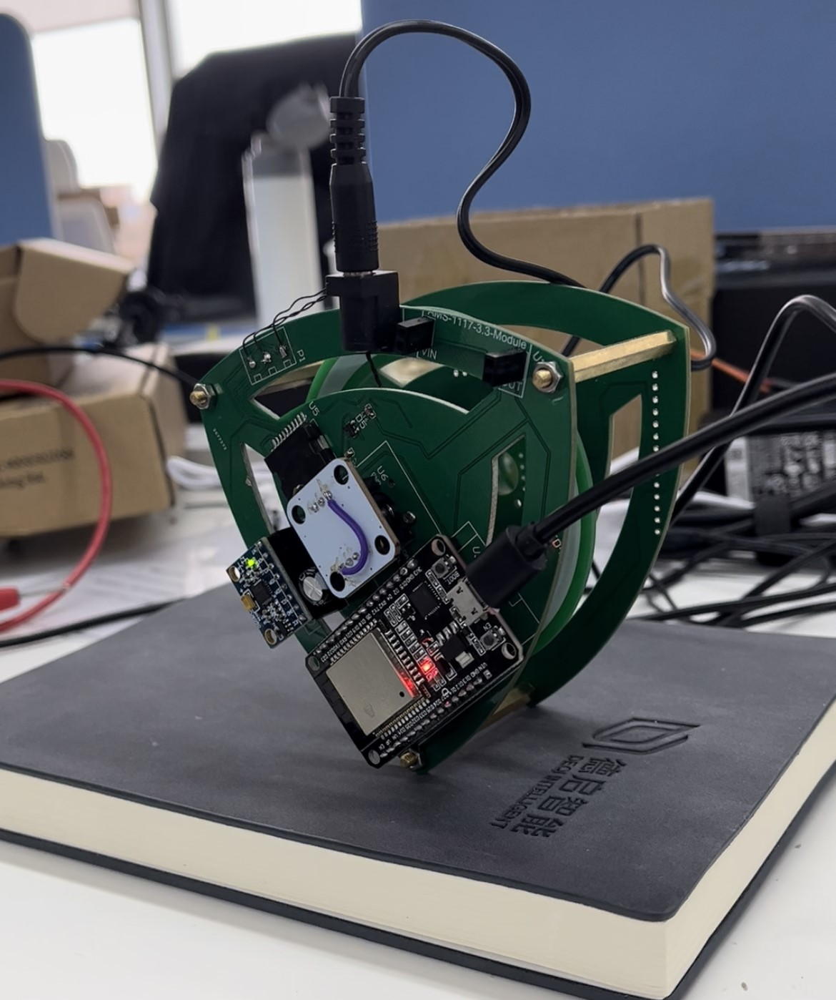

# Triangli--基于LQR控制器的自平衡莱洛三角

**原作者Git：** https://gitee.com/coll45/foc    

**B站教程：** 

## 0. 关于本项目

> 一叶知秋君莫笑我注：本项目是基于`原作者45coll`修改的，简化了硬件焊接工作，各模块通过购买均可获得，保留了驱动电路方案，
减少焊接难度的同时也能体验焊接的快乐，方案是基于`ESP-WROOM-32`的，乐鑫的一个很实用的MCU芯片。

## 1. 硬件打样说明

**PCB打样的话暂时没发现有啥需要特别注意的。** PCB文件可以直接拿去工厂，免费打样，器件BOM的话也都是比较常用的，整板成本在100元以内。

**外壳加工** 本项目皆由PCB构成，不需要3D打印，当然了动量轮也可以3D打印，其PCB文件在`1.Hardware`文件夹。
> 动量轮直径为800MM，莱洛三角为半径1000MM。

## 2. 固件编译说明

固件框架主要基于Arduino开发完成，玩过Arduino的基本没有上手难度了。本项目基于PlatformIO，直接编译`2.Firmware`即可。

> 我使用的是VSCode上面的PlatformIO插件进行Arduino开发，因为对VSCode比较熟悉，大家选择自己喜欢的IDE就好了。

## 其他的后续再补充，有用的话记得点星星~

